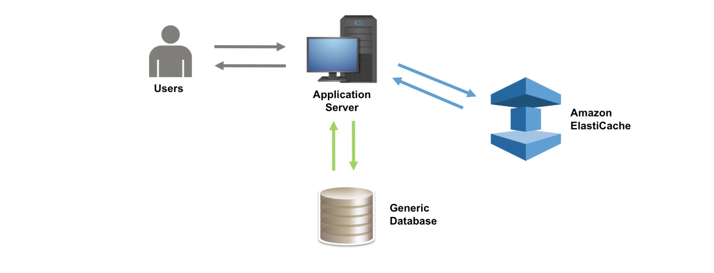
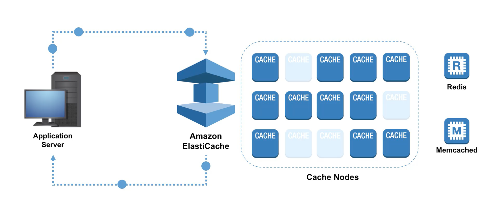
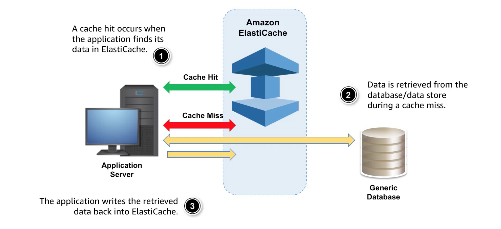
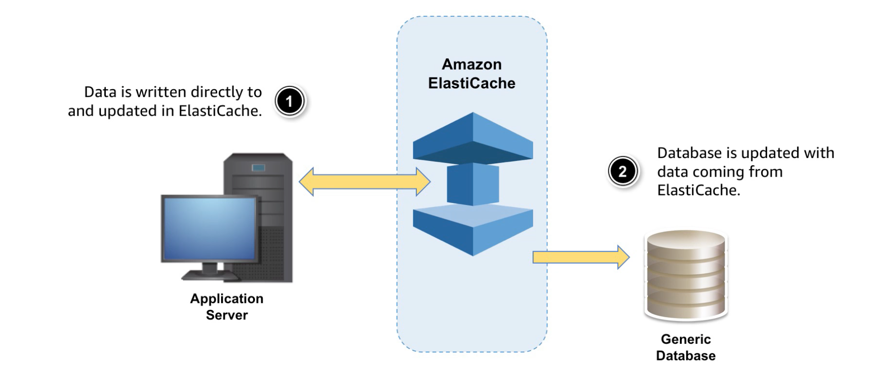
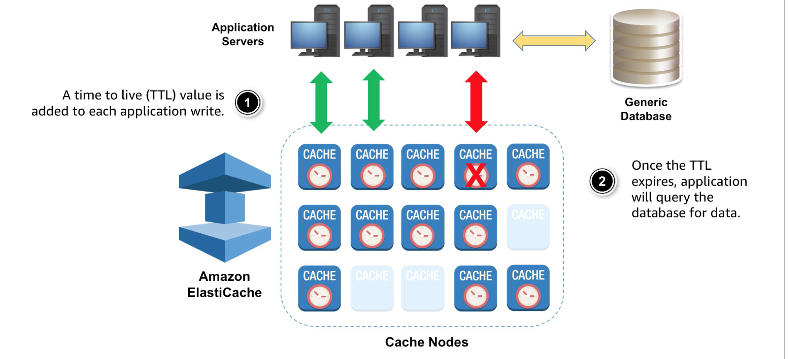
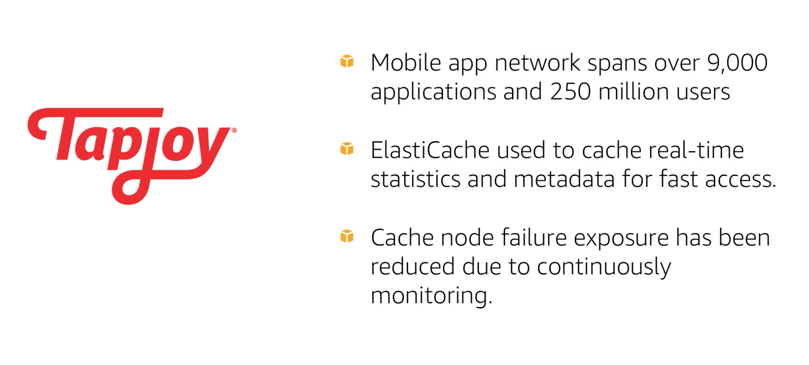
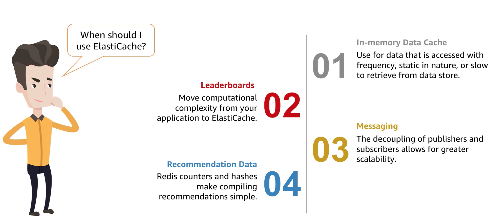

# Amazon-ElastiCache

### AWS ElastiCache: 
  
ElastiCache is a web service used to deploy, operate and scale in-memory cache in the cloud. Elasticache improve the performance of the web application  by allowing you to retrieve information fast, managed and in-memory data storage  instead of relying entirely on slower disk-storage database.

  
   

In the deploy, ElastiCache sits between application and data storage

Elasticache supports two open-source in-memory caching engines.

1. **Memcached**: Is an easy-to-use, high-performance, in-memory data store.

2. **Redis**: **R**emote **Di**ctionary **S**erver, is a fast, open-source, in-memory key-value data store for use as a database.

### How does it work:

    

**Cache Node**: is the smallest building block of an Elasticache deployment. A node is a fixed size chunk of secured test ram, exists in isolation from or some relationship to other nodes known as cluster. Each node runs in an instance of either **Memcached** or **Redis** depends on which was chosen when you created cluster. Existing applications that use **Memcached** or **Redis** in memory engines can use ElastiCache with almost no modification.

**Redis**: 

1. ElastiCache for Redis is fully managed in an ideal candidate for high performance use cases such as web, mobile app, Gaming, ad-Tech and IoT.
2. ElastiCache for Redis can scale up to **90 nodes** per cluster to increase data access performance.

**Memcached**: 

1. Can be preferable for relatively small and static data such as HTML code fragments.
2. Memcached comparatively use less memory resources from metadata.
3. ElastiCache with memcached can scale up to **20 nodes** per cluster.
4. ElastiCache is used to improve the latency and throughput for various applications and compute intensive work loads. 

### Caching Strategies:

Types of caching strategies:

***1. Lazy Loading***

***2. Write Through***

***3. Adding TTL***

***Lazy Loading***: Helps in stales the data in ElastiCache, caching Strategy that loads the data into the cache when it is necessary.
    
 

    

   - When ever application requests data, first it request for ElastiCache if it exists then ElastiCache return the data to the application.
    
   - Otherwise application request data to the data storage and then data storage return data to the application. Then application return that data to the ElastiCache. it will be quickly retrieved for future requests.
    
***Write Through***: Always ensure data is fresh. This Strategy add/updates the ElastiCache when data is written in to the data storage. When spinning up the new node or scaling up node we lost all the ElastiCache data and that scenarios we use Write Through.

    

***Adding TTL***: Using this Strategy we can minimise the space in ElastiCache.

   - Time to live key Strategy for each cache node to how long data present in the ElastiCache.
   
   - When application try to request the data which already expires, ElastiCache will return data not found and try to fetch from the data storage. 

    

### Use Cases:

***1. Expedia***: **Reduce Data Store Costs**

    

***2. TicketLeap.com***: **Absorb Rapid Traffic Growth**

    

***3. TapJoy***: **Decrease mobile app latency**

    

### Summary:

    

### References:

1. [https://aws.amazon.com/elasticache/](https://aws.amazon.com/elasticache/)
2. [https://aws.amazon.com/redis/](https://aws.amazon.com/redis/)
3. [https://aws.amazon.com/memcached/](https://aws.amazon.com/memcached/)
4. [https://www.aws.training/Details/Video?id=16348](https://www.aws.training/Details/Video?id=16348)
